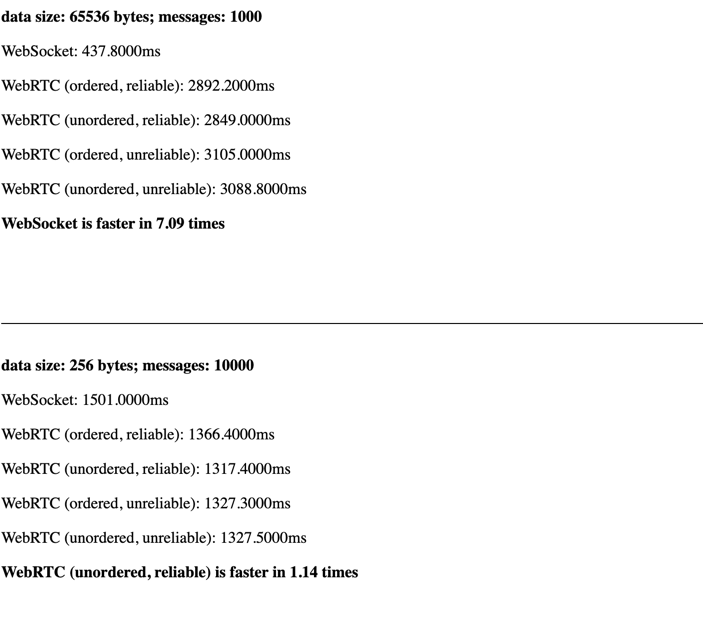
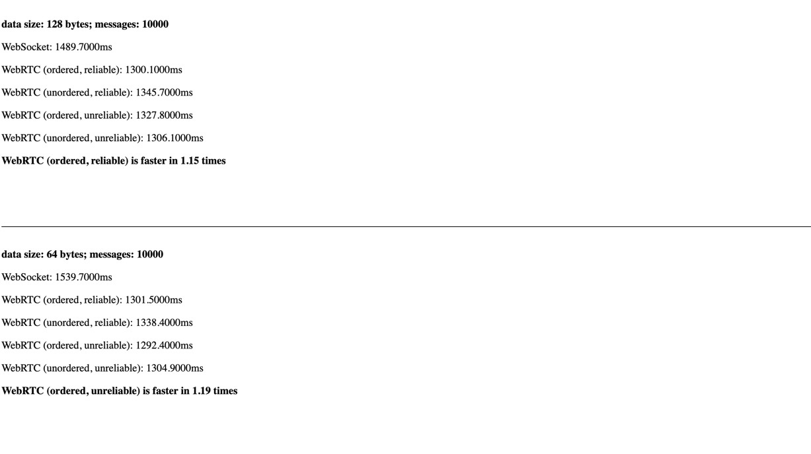
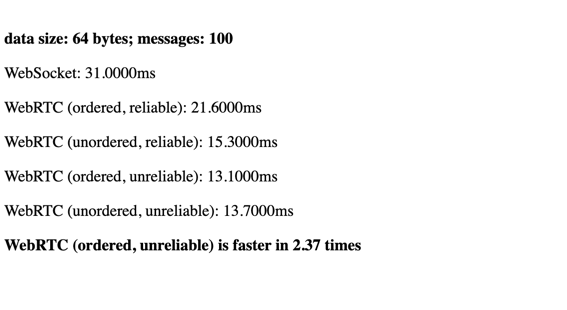

# WebSocket/WebRTC Benchmark

This project provides benchmarking to compare the performance characteristics of WebSocket and WebRTC DataChannel communications in the context of online game development.

## Technology Stack

- Go with [Pion WebRTC](https://github.com/pion/webrtc)
- Go with [FastWS](https://github.com/dgrr/fastws)
- JavaScript

## Building and Running

```shell
go install .
go run .
```

Access the application at: http://localhost:8080

## Setup and Architecture

The server is implemented in Go and functions as a loopback server (echoing received data back to the client).
The client performs a series of transmissions, sending a specified number of messages containing random bytes of a predetermined size. It measures the total round-trip time.

## Benchmark Results

Our performance analysis reveals that WebRTC demonstrates superior performance compared to WebSocket:

- **Key Findings**:
  - WebRTC DataChannel achieves 1.15-2.5x faster communication speeds compared to WebSocket
  - Performance advantages vary across different message sizes and browsers
  - The performance gap is more pronounced with smaller message sizes and frequencies
  - WebSocket performance improves relative to WebRTC as data volume increases





> Note: These results represent averaged measurements from multiple test runs under controlled conditions. Actual performance may vary based on network conditions, message payload size, and specific implementation requirements.

